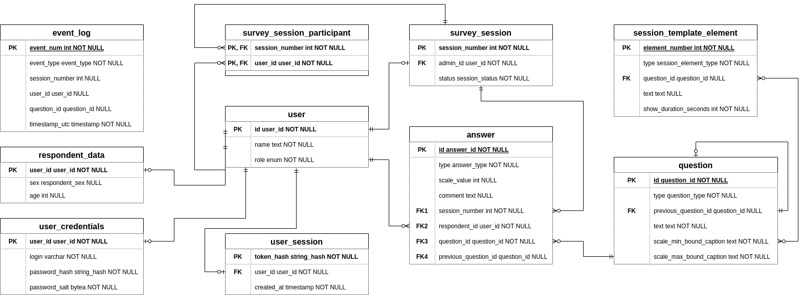

# Japanese Food Survey Backend

This is the backend service to be used together with [Japanese Food Survey Frontend](https://github.com/ito-tachibana/jst-frontend.git).

## Running the Project

This project requires `SBT` (Scala Build Tool) and `JDK` 11 (Java Development Kit 11) to be installed.
Installation instructions:
- `SBT`: [installation](https://www.scala-sbt.org/download.html)
- `JDK`: [installation](https://www.oracle.com/java/technologies/downloads/#java11)

Compiling the project:
`sbt stage`

Running the project:
`sbt run`

This project uses the third version of the Scala programming language (Scala 3). For more information about using Scala 3 with `SBT`, 
see the [scala3-example-project](https://github.com/scala/scala3-example-project/blob/main/README.md).

## Deployment

This project is set up to be complied and deployed to the Heroku online hosting platform. Make sure you have everything
from the [Running the Project](#running-the-project) section installed.

Deploying the project requires Heroku `CLI` (Command Line Interface) to be installed. Refer to [this page](https://devcenter.heroku.com/articles/heroku-cli)
for installation instructions.

Deployment configuration is provided in the `build.sbt` file. Refer to [heroku-sbt plugin page](https://github.com/heroku/sbt-heroku)
for documentation.

Deploying the project:
- `heroku login`
- `sbt stage deployHeroku`

## Backend interaction

### Creating a user

By default, there is only a single user with administrator privileges and default credentials stored in the database.
The owners of the service are encouraged to create a new administrator user with different credentials and use it to create
other users by utilizing the **create user** API.

### User log in

Users can log in and log out any number of times as long as the valid credentials are provided, but there can only be a single
active user session per user - logging in overwrites any older user sessions.

### Survey session flow

All users are required to be **logged in** before they can interact with a survey session. After logging-in, an administrator
must **create** a session and establish a websocket connection by **connecting** to it. All the session's respondents
need to then **connect** to it as well.

While all participants are connected to the session, the server communicates with each of them via websocket messages. 
Users may lose connection to the server and reconnect to it without affecting the flow of the session.

## API spec

API documentation is located under `documentation/api/swagger.yaml`. This file can be uploaded to [swaggerhub](https://swagger.io/tools/swaggerhub/)
for a human-readable API specification. Refer to the website for documentation on how to use it.

The backend server URL can be retrieved from the Heroku dashboard by clicking the "Open App" button and copying it
from the new browser window. Sample API requests are provided below, substitute values in angle brackets for necessary values.
All examples are provided using the [curl](https://curl.se/) command-line utility, but it may be desirable to use tools
like [Postman](https://www.postman.com/) or other means of automation to repeatedly query the service.

- `log in`:
  This request will set a cookie by the name `JFSBSESSIONID`. It has to be included in all requests that require authentication.
  ```shell
  curl --location --request POST '<BACKEND_SERVER_URL>/auth/login' \
    --header 'Content-Type: application/x-www-form-urlencoded' \
    --data-urlencode 'login=<USER_LOGIN>' \
    --data-urlencode 'password=<USER_PASSWORD>' 
  ```
- `log out`:
  ```shell
  curl --location --request POST '<BACKEND_SERVER_URL>/auth/logout' \
  --header 'Content-Type: application/x-www-form-urlencoded' \
  --header 'Cookie: JFSBSESSIONID=<AUTH_COOKIE>'
  ```
- `create user`:
  ```shell
  curl --location --request PUT '<BACKEND_SERVER_URL>/user/create' \
    --header 'Content-Type: application/x-www-form-urlencoded' \
    --header 'Cookie: JFSBSESSIONID=<AUTH_COOKIE>' \
    --data-urlencode 'name=<USER_NAME>' \
    --data-urlencode 'login=<USER_LOGIN>' \
    --data-urlencode 'password=<USER_PASSWORD>' \
    --data-urlencode 'role=<USER_ROLE>'
  ```
- `stop session`:
  This 
  ```shell
  curl --location --request POST '<BACKEND_SERVER_URL>/session/stop' \
    --header 'Cookie: JFSBSESSIONID=<AUTH_COOKIE>' 
  ```

## Database schema

This service uses [PostgreSQL](https://www.postgresql.org/) as its RDBMS (Relational DataBase Management System).

Database diagram made with [draw.io](http://draw.io) - use it to open the diagram image file and modify the diagram.

**Don't change the database schema manually.** It is managed by the application with migrations specified as SQL
files stored under `src/main/resourced/db/migration`.



### Connecting to the Heroku database

**It is recommended to download the database snapshot locally to avoid interfering with the application.**

You can find all the connection details under the `Resources/Heroku Postgres` tab and use any database connection tool 
that works with PostgreSQL.

If connecting through an [Intellij](https://www.jetbrains.com/idea/) interactive development environment, create
the database connection as follows:
- Database Tool Window / New / Data Source / PostreSQL:  
    Fill in Host, Port, Database, User, Password that you find through the dashboard.
- Go to Advanced tab and put:
  - `ssl`: true
  - `sslmode`: verify-ca
  - `sslfactory`: org.postgresql.ssl.NonValidatingFactory
- Click `Apply` and create the connection.

### Table description

- `user` (key user information):
  - `id` - service-generated user identifier
  - `name` - user's real name
  - `role` - one of `admin`, `respondent`
- `user_session` (user session information):
  - `token_hash` - a hash of the token used to identify the user.
  - `user_id` - user id associated with the session.
  - `created_at` - timestamp of when the session was created.
- `user_credentials` (user login information):
  - `user_id` - user id associated with the credentials.
  - `login` - username used for logging into the system.
  - `password_hash` - hash of the password used for logging into the system.
  - `password_salt` - a byte string used to safely decode the password.
- `respondent_data` (respondent personal information):
  - `user_id` - user id associated with the information.
  - `sex` - user's sex, one of `male`, `female`, `other`, `unspecified`.
  - `age` - user's age.
- `question` (session question information):
  - `id` - question identifier.
  - `type` - one of `basic`, `repeated`. Use the latter if the question will be using one of the previous question's answers during the session.
  - `previous_question_id` - an identifier of the question to reference (must be provided if the `type` is `repeated`).
  - `text` - question text to display.
  - `scale_min_bound_caption` - lower scale text to display.
  - `scale_min_bound_caption` - upper scale text to display.
- `session_template_element` (session structure data):
  - `element_number` - the session element's sequence number. Numbers should form a sequence without any gaps that starts from 1.
  - `type` - one of `question`, `question_review`, `text`.
  - `question_id` - referenced question id (must be provided if the `type` is `question` or `question_review`).
  - `text` - text to display (must be provided if the `type` is `text`).
  - `show_duration_seconds` - the amount of time in seconds to display this element for during the session.
- `survey_session` (survey session data):
  - `session_number` - service-generated session number.
  - `admin_id` - the id of the session's administrator.
  - `session_status` - one of `awaiting_users`, `finished`.
- `answer` (question answer data):
  - `id` - service-generated answer id for easier reference.
  - `type` - one of `basic`, `repeated`, depending on the respective question type.
  - `scale_value` - user's response value.
  - `comment` - user's comment.
  - `session_number` - respective session's number.
  - `respondent_id` - respective respondent's id.
  - `question_id` - respective question id.
- `survey_session_participant` (session participant list):
  - `session_number` - respective session's number.
  - `user_id` - respective respondent's id.
- `event_log` (session event log):
  - `id` - auto-generated log id.
  - `event_type` - `user_login`, `respondent_data_submit`, `session_create`, `session_join`, `session_begin`, `answer_submit`, `session_pause`, `session_resume`, `session_finish`
  - `session_number` - respective session's number.
  - `respondent_id` - respective respondent's id.
  - `question_id` - respective question id.
  - `timestamp_utc` - the time of when the log was created in the UTC timezone.

